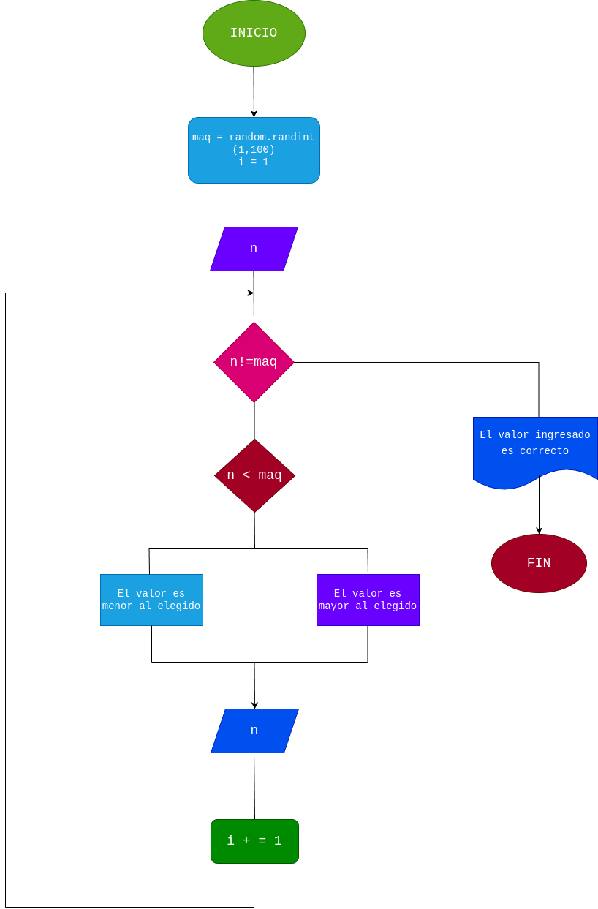

# Adivina_el_numero

# Analisis

El programa es un juego de adivinanza en el que el usuario debe adivinar un número secreto generado aleatoriamente entre 1 y 100. El programa le indicará al usuario si la adivinanza es menor o mayor que el número secreto, y contará el número de intentos realizados hasta que el usuario adivine correctamente.

## Input

La adivinanza del usuario: un número entero introducido por el usuario en cada intento.

### Variables de entrada

maq: número entero generado aleatoriamente entre 1 y 100 (número secreto a adivinar).

i: contador de intentos, inicializado en 1.

n: número entero introducido por el usuario como adivinanza en cada intento.

### Proccesing

Generar número aleatorio:

maq = random.randint(1, 100)

Inicializar contador de intentos:

i = 1

Ciclo de adivinanza:

Solicitar adivinanza: n = int(input("Introduce tu adivinanza: "))

Comparar adivinanza con el número secreto:

Si n < maq, mostrar "El valor es mayor al elegido."

Si n > maq, mostrar "El valor es menor al elegido."

Si n == maq, mostrar "¡Felicidades! Adivinaste el número en X intentos."

Incrementar contador de intentos: i += 1

### Output

n

# Diseño

# Construcción